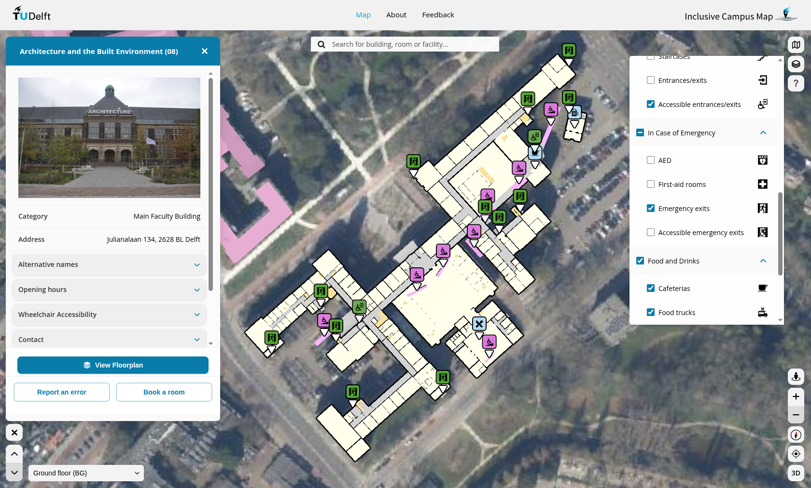

# Inclusive TU Delft Map

This is the repository of the GEOIT1501 project called "Inclusive 3D Campus Map" and hosted at <https://inclusivecampusmap.bk.tudelft.nl>.

| Outdoor view | Floor plan of BK |
| ---------------------- | ---------------------- |
|  |  |

You can also find more information about it in the [about page of the website](https://inclusivecampusmap.bk.tudelft.nl/about.html).

## Documentation

The documentation of this project is split in multiple parts.
You can find documentation about:

- General information about the data pipeline used in the project in [Data_pipeline.md](./documentation/Data_pipeline.md).
- General information about the expected structure of data used in the project in [Data_structure.md](./documentation/Data_structure.md).
- The Python code that is used to process and format the data is in [Python_scripts.md](./documentation/Python_scripts.md).
- The JavaScript app used to make the map in [JavaScript_app.md](./documentation/JavaScript_app.md).
- The setup of the server that hosts the map in [./documentation/Server.md](./documentation/Server.md).
