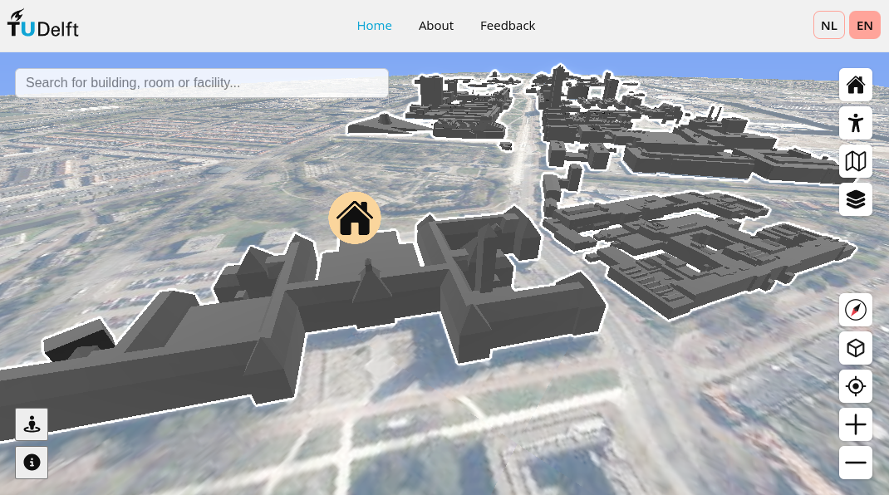

# Inclusive TU Delft Map

This is the repository of the GEOIT1501 project called "Inclusive 3D Campus Map" and hosted at <https://inclusivecampusmap.bk.tudelft.nl>.

You can also find more information about it in the [about page of the website](https://inclusivecampusmap.bk.tudelft.nl/about.html).

## Documentation

The documentation of this project is split in multiple parts.
You can find documentation about:

- General information about the data pipeline used in the project in [./Data_pipeline.md](Data_pipeline.md).
- General information about the expected structure of data used in the project in [./Data_structure.md](Data_pipeline.md).
- The Python code that is used to process and format the data is in [./src/README.md](src/README.md).
- The JavaScript app used to make the map in [./threejs/README.md](threejs/README.md).
- The choices behind the database and how to set it up in [./database/README.md](database/README.md).
- The setup of the server that hosts the map in [./server/README.md](server/README.md).
