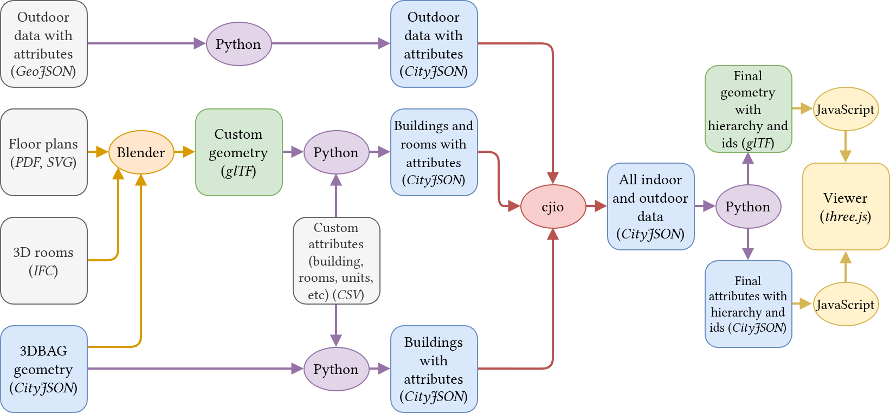

# Data Pipeline

This document will explain the data pipeline of the project, starting with the principles, up until the actual commands used to execute it.
We call data pipeline the process that starts from the "raw" input data of the map (geometry and attributes) and ends up with the final formatted data ingested by the map using JavaScript.

## Prerequisites

To be able to run the commands mentioned below, you first need to install the Python environment. Read [python_scripts.md](./python_scripts.md) for more information.

To learn more about the data structure and conventions used in this project, please read [data_structure.md](./data_structure.md).

## Explanations

The main goals of this data pipeline are:

1. Combine different data:
    - From different sources
    - In different formats
2. Format the data into a convenient format for the web app

This means that the pipeline can be divided between three phases:

1. [Initial Processing](#initial-processing): Different branches and processes format and combine parts of the data into similarly formatted data.
2. [Data Combination](#data-combination): The results of all branches are combined into one single coherent file.
3. [Final Formatting](#final-formatting): This file is converted into a convenient input for the web app.



### Initial Processing

The initial data processing and formatting is subdivided between three different branches corresponding to the different kinds of data:

1. [3DBAG Geometry](#3dbag-geometry): When a building is simply represented with its outer shell from the 3DBAG and does not include any indoor data.
2. [Custom Geometry](#custom-geometry): When a building has custom geometry for the outer shell and potentially indoor data.
3. [Outdoor Data](#outdoor-data): All the outdoor data, defined by data that is not linked to any building.

#### 3DBAG Geometry

The command to load 3DBAG data is [`load_3dbag`][cli.load_3dbag] from `cli.py`.
Since the 3DBAG only contains the outer shells of the buildings, the command can take attributes about the buildings and buildings' subdivisions.
A number of columns need to be present in the attributes to be able to group 3DBAG objects together, assign them a new identifier, and skip buildings that come from other sources.

Here is an example of running the command:

```bash
# From python/
uv run data-pipeline load_3dbag \
    <input_cityjson> \
    <output_cityjson> \
    -b <csv_buildings_attributes_path> \
    -s <csv_buildings_subdivisions_attributes_path> \
    -vv
```

#### Custom Geometry

The command to load the custom geometry is `load_custom_building` from `cli.py`.
Since the custom geometry is expected to have been processed for this project, there are more requirements on the expected format.
The expected input must be glTF, but the hierarchy of the scene does not matter, only the identifiers of the objects are important.
The glTF file is not expected to have attributes (they will be ignored if there are any), as the attributes are joined from one or multiple CSV files.
However, every object identifier should have a name following this convention: `<object_unique_id>.lod_<lod>` where:

- `<object_unique_id>` must be:
    - `<Building>` for a building,
    - `<Building>.<Part>` for a building part,
    - `<Building>.<Part>.<Storey>` for a storey,
    - `<Building>.<Part>.<Storey>.<Room>` for a room.
- `<lod>` is the level of detail, which can only be 0, 1, 2 or 3.

So the outer shell of a building could be `08.lod_2` while the 2D footprint of a room in the same building could be `08.02.00.600.lod_0`.
The loader automatically builds a hierarchy based on this numbering, and assigns the right types to each object.
It also automatically creates the intermediate levels if they do not exist (so it is not a problem if there is no `08.02.lod_<lod>` in the file).

Finally, to add attributes to the geometry CSV files are once again expected.
The link with the geometry will be made based on their `<object_unique_id>` (without `.lod_<lod>`) in the glTF and in the specific column from the CSV file.

Here is an example of running the command:

```bash
# From python/
uv run data-pipeline load_custom_building \
    <input_glb> \
    <output_cityjson> \
    -b <building_attributes_path> \
    -p <building_parts_attributes_path> \
    -s <building_storeys_attributes_path> \
    -r <building_rooms_attributes_path> \
    -u <building_units_attributes_path> \
    -g <building_units_geometry_gltf_path> \
    -vv
```

#### Outdoor Data

### Data Combination

### Final Formatting

To split the content of a CityJSON file into the geometry in glTF and the attributes in CityJSON, we use the command `split_cj` from `cli.py`.
The resulting glTF and CityJSON both store the structure of the file, with the same identifiers to be able to link them together.

You can simply call it like this:

```bash
# From python/
uv run data-pipeline split_cj <cityjson_input> <folder_output>
```

## Actual Commands

### Update the Pipeline

1. Go to `python`:

    ```bash
    cd python
    ```

2. Process 3DBAG data:

    ```bash
    uv run data-pipeline load_3dbag \
        ../threejs/assets/processing_input/bag_geometry/subset.city.json \
        ../threejs/assets/processing_output/3dbag.city.json \
        -b ../threejs/assets/processing_input/attributes/buildings.csv \
        -s ../threejs/assets/processing_input/attributes/subdivisions.csv \
        --overwrite \
        -vv
    ```

3. Process custom geometry:

    ```bash
    uv run data-pipeline load_custom_building \
        ../threejs/assets/processing_input/custom_geometry/08.glb \
        ../threejs/assets/processing_output/08.city.json \
        -b ../threejs/assets/processing_input/attributes/buildings.csv \
        -p ../threejs/assets/processing_input/attributes/parts.csv \
        -s ../threejs/assets/processing_input/attributes/storeys.csv \
        -r ../threejs/assets/processing_input/attributes/rooms.csv \
        -u ../threejs/assets/processing_input/attributes/units.csv \
        -g ../threejs/assets/processing_input/custom_geometry/08-navigation_elements.glb \
        --overwrite \
        -vv
    ```

4. Process the outdoor icons:

    ```bash
    uv run data-pipeline load_outdoor \
        ../threejs/assets/processing_input/all_outdoor_objects.geojson \
        ../threejs/assets/processing_output/outdoor.city.json
    ```

5. Merge them together:

    ```bash
    uv run cjio ../threejs/assets/processing_output/08.city.json \
        merge ../threejs/assets/processing_output/3dbag.city.json \
        merge ../threejs/assets/processing_output/outdoor.city.json \
        save  ../threejs/assets/processing_output/all_buildings.city.json
    ```

6. Split into CityJSON and glTF used by the map:

    ```bash
    uv run data-pipeline split_cj \
        ../threejs/assets/processing_output/all_buildings.city.json \
        ../threejs/assets/threejs/buildings \
        --overwrite \
        -vv
    ```

### Other Useful Commands

#### Extract the 3DBAG Buildings

To make one CityJSON file with all the buildings that we want, we followed this process:

1. Download all the necessary tiles from the [3DBAG](https://3dbag.nl/en/download?tid=9-284-556).
2. Merge them all into one with `cjio`:

    ```bash
    uv run cjio \
        ../threejs/assets/processing_input/bag_geometry/all_tiles/10-284-560.city.json \
        merge '../threejs/assets/processing_input/bag_geometry/all_tiles/*.city.json' \
        save ../threejs/assets/processing_input/bag_geometry/all_merged.city.json
    ```

3. Extract only the necessary buildings with a custom script based on `cjio`:

    ```bash
    uv run data-pipeline subset_cj \
        ../threejs/assets/processing_input/bag_geometry/all_merged.city.json \
        ../threejs/assets/processing_input/bag_geometry/subset.city.json \
        ../threejs/assets/processing_input/bag_geometry/all_bag_ids-only_tud.txt
    ```

In practice, we also used this command to extract the different parts of a building that was removed in a subsequent 3DBAG version:

```bash
uv run cjio ../threejs/assets/processing_input/bag_geometry/all_merged_old.city.json \
    subset \
        --id NL.IMBAG.Pand.0503100000004736 \
        --id NL.IMBAG.Pand.0503100000016058 \
        --id NL.IMBAG.Pand.0503100000030991 \
        --id NL.IMBAG.Pand.0503100000004735 \
        --id NL.IMBAG.Pand.0503100000016055 \
        --id NL.IMBAG.Pand.0503100000016057 \
    save ../threejs/assets/processing_input/bag_geometry/building_60.city.json
```
